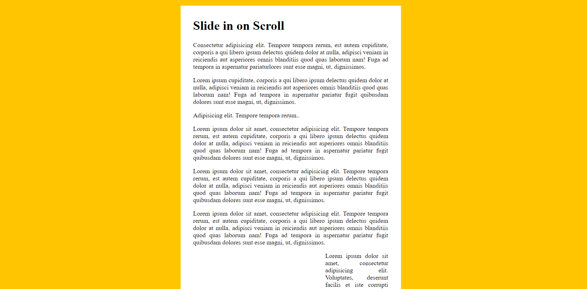

# Slide in on Scroll

Download or clone repository and click the index.html file to run.

Images slide in from the left or right as you reach them when you scroll down the page.



### Checking images

```
function checkSlide(e) {
  sliderImages.forEach(sliderImage => {

    // half way through the image
    const slideInAt = (window.scrollY + window.innerHeight) - sliderImage.height / 2;

    // bottom of the image
    const imageBottom = sliderImage.offsetTop + sliderImage.height;

    const isHalfShown = slideInAt > sliderImage.offsetTop;
    const isNotScrolledPast = window.scrollY < imageBottom;

    if(isHalfShown && isNotScrolledPast) {
      sliderImage.classList.add('active');
    } else {
      sliderImage.classList.remove('active');
    }
}
```

the `.offsetTop` tells the top of image is how far from the top of the actual window